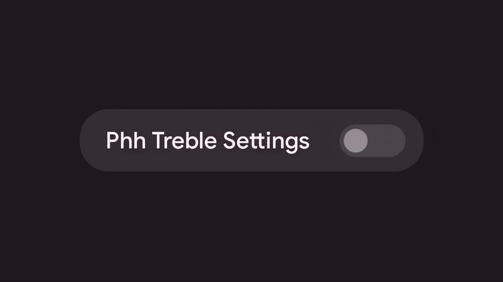

<h2>Disable Phh Treble</h2>
Remove the annoying Phh Treble setting to the aesthetics of your device settings.

## Warning!!!
This module is only tested on Magisk Kitsune version. It may cause bootloop in APatch / KernelSU

## Downloads
To download this module, please go to the [Release](https://github.com/KeishaXD/Disable-Phh-Treble/releases/tag/V1.0.0) page
